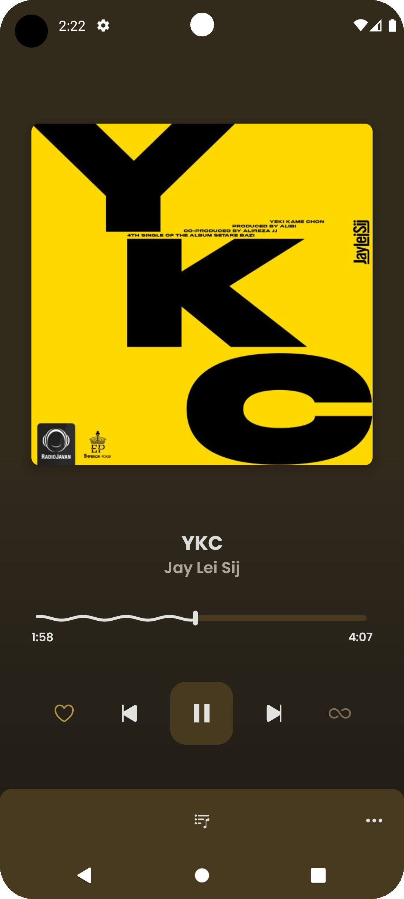
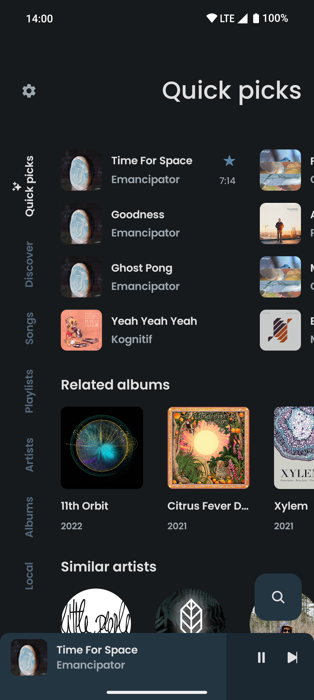
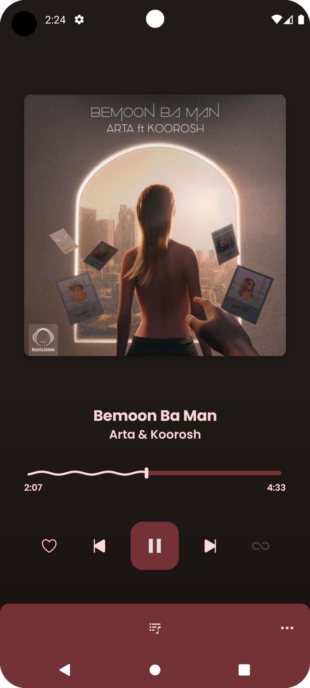
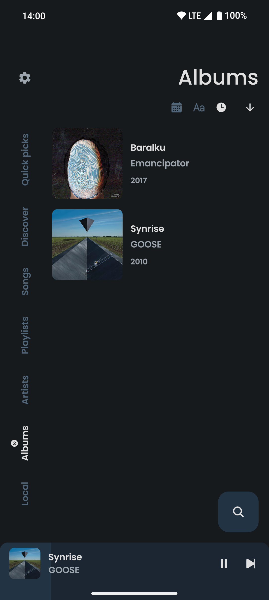
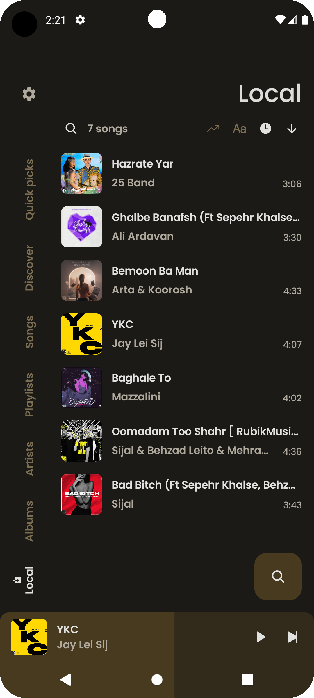
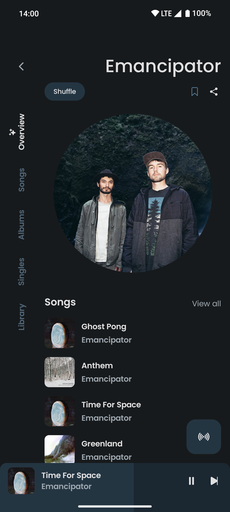
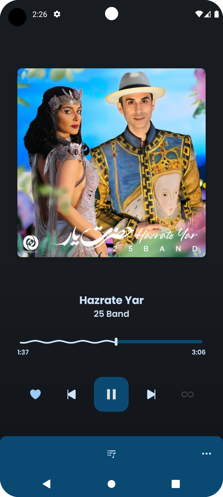
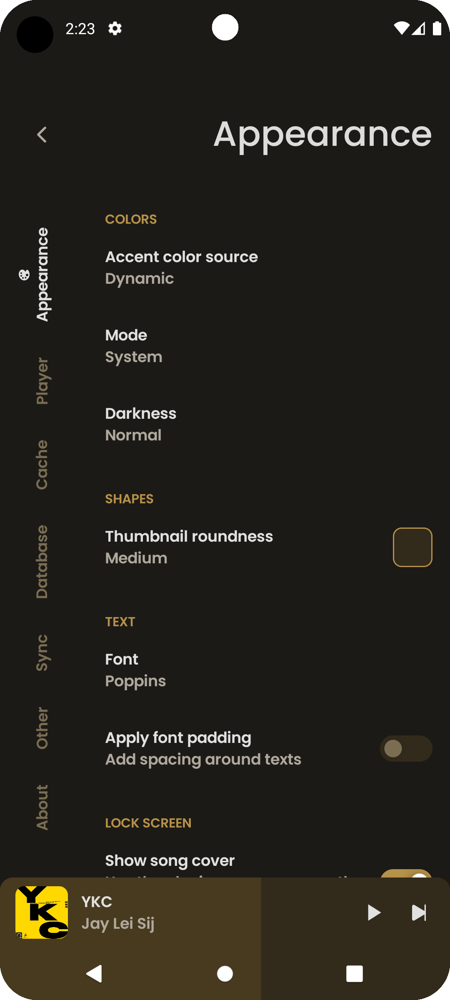

<!-- markdownlint-disable MD033 -->
<!-- markdownlint-disable MD041 -->
<!-- markdownlint-disable MD045 -->

    
    <h1>Banafsh</h1>
    
An Android application for seamless music streaming

---

  
  
  
  
  
  
  
  

## Features

- Play music from your device
- Play songs in the background
- Search for songs, albums, artists and playlists
- Discover new songs by mood/genre
- Highly customizable (dynamic theme, Material You, ...)
- Listen from your car using Android Auto
- Ridiculously lightweight APK
- Generate Dynamic Material Design 3 Colors.

## Installation

## Acknowledgments

- [**ViTune**](https://github.com/25huizengek1/ViTune): An Android application for seamless music streaming
- [**ionicons**](https://github.com/ionic-team/ionicons): Premium hand-crafted icons built by Ionic,
  for Ionic apps and web apps everywhere.

---
